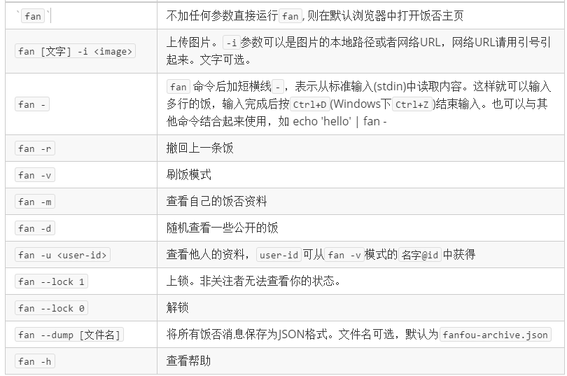

## 饭否命令行客户端

[](https://badge.fury.io/py/fanfou-cli)
[](https://img.shields.io/badge/python-3.5-blue.svg)
[](https://img.shields.io/badge/license-MIT-blue.svg)

### 安装
- 通过pip安装
```sh
pip3 install fanfou-cli
```
- 手动安装
```sh
git clone https://github.com/j178/fanfou-cli
cd fanfou-cli
pip3 install . --user
```

### 使用

**日常使用**：

```sh
fan 任意文字，不需要引号，可以包含空格，fan命令之后的任意内容均被当作新饭的内容
```

**其他功能**:  


初次使用时，此工具需要获取你的授权才能帮你发饭。
此工具支持两种授权方式：
- 一种是 OAuth，这种方式无需获取你的密码，是默认的授权方式。  
- 另一种是 XAuth，这种方式需要你输入用户名和密码（输入密码时自动关闭回显），适合在没有浏览器的场景使用，在使用 `--xauth` 参数时会使用此种方式。

**你的密码仅在初次授权时需要，此工具不会保存**

如果你想取消对此工具的授权，可以随时访问 `http://fanfou.com/settings/apps`, 找到`爱米饭`， 然后`取消认证`就可以了啦~。如下图所示：  


### 说明
- 此工具会在`~/.fancache`(*unix系统)或 `%USERPROFILE%/.fancache`中保存认证凭据(`access_token`)，用户的饭否资料，和你的最新的一条饭否消息。你可以随时删除这个文件，不过删除之后需要重新授权。
- OAuth认证时，此工具会启动一个HTTP服务器，并监听本地的`8000`端口。Windows下会弹出权限提示，为了能够正常授权，请选择允许。
- 上锁/解锁功能需要你在浏览器中的 cookie。在浏览器中打开饭否页面，然后按`F12`打开控制台，执行以下`Javascript`代码，将代码的输出结果粘贴到脚本中。
    ```javascript
    (/al=(.*?);/i).exec(document.cookie)[1]
    ```

### 依赖
- Python3
- requests-oauthlib
- arrow

### TODO
- [x] 图片上传
- [x] colorize
- [x] time humanize
- [x] 转发/评论消息
- [x] 上锁/解锁功能
- [x] 简化授权流程
- [x] 查看图片
- [x] xauth支持
- [ ] 修改配置功能
- [ ] 多账号切换
- [ ] 备份进度条
- [ ] 查看提到我的消息
- [ ] 查看私信
