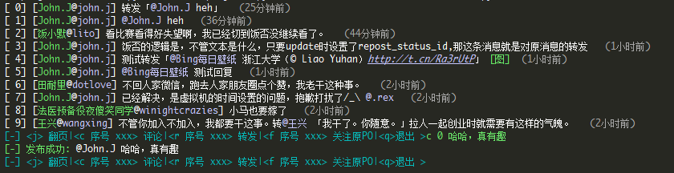
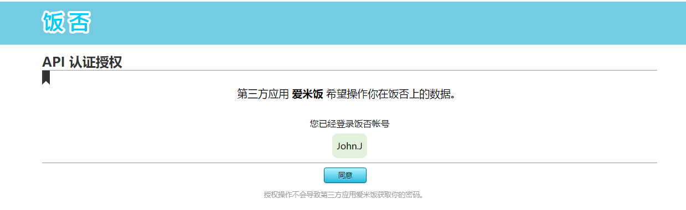

## 饭否命令行客户端

[](https://badge.fury.io/py/fanfou-cli)
[](https://img.shields.io/badge/python-3.5-blue.svg)
[](https://img.shields.io/badge/license-MIT-blue.svg)
### 安装
- 通过pip安装
```sh
pip3 install fanfou-cli
```
- 手动安装
```sh
git clone https://github.com/j178/fanfou-cli
cd fanfou-cli
pip3 install . --user
```

### 使用


**日常使用**：

```sh
fan 任意文字，不需要引号，可以包含空格，fan命令之后的任意内容均被当作新饭的内容
```

**其他功能**:
- 不加任何参数直接运行`fan`, 则在默认浏览器中打开饭否主页
- `fan 任意文字 -i <image-filename>/<image-url>` 上传图片。
    `-i`参数可以是图片的本地路径或者网络URL，网络URL请用引号引起来。文字可以为空。
- `fan -`  `fan`命令后加短横线`-`，表示从标准输入(stdin)中读取内容。这样就可以输入多行的饭，输入完成后按`Ctrl+D`(Windows下`Ctrl+Z`)结束输入。
    也可以与其他命令结合起来使用，如`echo 'hello' | fan -`
- `fan -r` 撤回上一条饭
- `fan -v` 在终端上刷饭
    在此模式下，`j`键翻页，`x`键刷新，`c 序号 xxx` 评论一条饭，`r 序号 xxx` 转发一条饭，`f 序号`关注一条被转发的饭的原PO，`u 序号`取消关注
- `fan -m` 查看自己的饭否资料
- `fan -d` 随机查看一些公开的饭
- `fan -u <user-id>` 查看他人的资料，`user-id`可从`fan -v`模式的`名字@id`中获得
- `fan --lock 1` 上锁；`fan --lock 0` 解锁
- `fan --dump <文件名>` 将所有饭否消息保存为JSON格式。文件名可选，默认为`timeline.json`
- `fan -h` 查看帮助


初次使用时，此工具需要获取你的授权才能帮你发饭。
1. 首先执行`fan`的任意命令
```sh
$ fan -m
```
工具会提示"是否自动打开授权页面"，即自动打开浏览器，跳到饭否授权的页面，选择否的话则需要手动将链接粘贴到浏览器中打开。

2. 打开之后会出现如下授权页面：
    
    点击同意。

3. 然后，浏览器会重定向到一个本地链接，访问在本地监听的HTTP服务器，如果看到页面提示 ‘授权成功’，则表示授权已经完成，现在可以愉快地刷饭了！

**整个授权过程都是使用饭否官方地OAuth API，此工具无法获取到你的密码。如果你想取消对此工具的授权，
可以随时访问 `http://fanfou.com/settings/apps`, 找到`爱米饭`， 然后`取消认证`就可以了啦~。如下图所示：**


### 说明
- 此工具会在`~/.fancache`(*unix系统)或 `%USERPROFILE%/.fancache`中保存认证凭据(`access_token`)，用户的饭否资料，和你的最新的一条饭否消息。你可以随时删除这个文件，不过删除之后需要重新授权。
- 此工具会在本地开启一个HTTP服务器，监听`8000`端口。Windows下会弹出权限提示，为了能够正常授权，请选择允许。
- 上锁/解锁功能需要你在浏览器中打开饭否页面，然后按`F12`打开控制台，执行以下`Javascript`代码，将代码的输出结果粘贴到脚本中。
    ```javascript
    (/al=(.*?);/i).exec(document.cookie)[1]
    ```
    
### 依赖
- Python3
- requests-oauthlib
- arrow

### TODO
- [x] 图片上传
- [x] colorize
- [x] time humanize
- [x] 转发/评论消息
- [x] 上锁/解锁功能
- [x] 简化授权流程
- [x] 查看图片
- [x] 多账号切换
- [ ] 备份进度条
- [ ] 查看提到我的消息
- [ ] 查看私信
